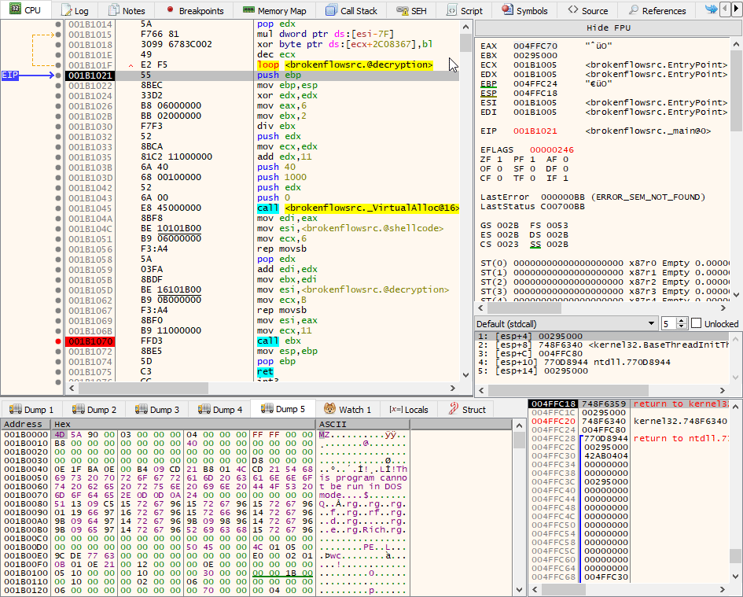

# BrokenFlow
A simple PoC to invoke an encrypted shellcode by using an hidden call.

## Introduction
This code uses a simple trick **to hide the instruction that effectively will jump to our shellcode**. This should make the static analysis or emulation more challenging.

As always, if this concept was already explained in some other papers just send me a message and I will happily add it to the references.

# Details
The memory layout to use this technique is the standard one and descrybed in Figure 1.

        ┌───────────────────────────────┐
        │                               │
        │                               │
        │                               │
        │                               │
        │   encrypted shellcode         │
        │                               │
        │                               │
        │                               │
        │                               │
        │                               │
        │                               │
        ├───────────────────────────────┤
        │                               │
        │                               │
        │  decryption loop              │
        │                               │
        │                               │
        └───────────────────────────────┘

Figure1. Memory Layout

The decryption loop will decrypt the shellcode and jump to it. All the "magic" is inside the decryption loop, since after finished decrypting the shellcode, the decryption loop will start to decrypt its own code. The decryption of the first instruct will result in a jump to our shellcode that is executed at the next loop iteration :)

Below the relevant part:

    @decryption:
    xor word ptr [eax], 06799h ; <jmp esi bytes> XOR <first two bytes of this instruction>
    add eax, sizeof word
    dec ecx
    loop @decryption
    
As you can see, **the decryption loop does not contain any instruction that jumps to the decrypted shellcode**. The assembly code is assembled in the following binary format:

    66:8130 9967             | xor word ptr ds:[eax],6799                                 
    83C0 02                  | add eax,2                                                    
    49                       | dec ecx                                                      
    E2 F5                    | loop 450006
    
in this case, the decryption key **must be 06799h**, since the XOR operation between 8166h (the first two bytes of the first instruction of the decryption loop) and 6799h (the XOR key) is e6ffh which is assembled to **jmp esi**. By setting the ESI register to the start of our shellcode, we can achieve execution :)

Below an example of debugging. Initially the encrypted shellcode is copied, following by the code used to decrypt and call it. You can noticed that after the third execution of the decryption loop the instruction **xor word ptr ds:[eax],6799** changes to **jmp esi**.

# Usage
The steps to use this technique are:
* Encrypt your shellcode with the XOR key 0x6799. The encryption loop iteration must have a WORD size step (2-bytes);
* Create the memory layout as reported in Figure 1. The encrypted shellcode size must be a multiple of two;
* Set the register ECX to the size of the allocated memory;
* Set register ESI to the start of the allocated memory (this address contains the shellcode to execute);
* Call the shellcode decryption code
